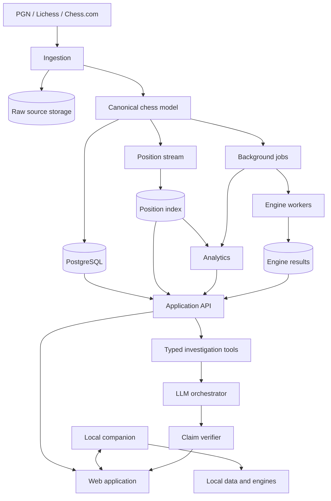

# System overview

Status: proposed baseline; validate through ADRs and benchmarks

## Architectural goals

- serve the first database-and-analytics product without premature distribution;
- preserve a path from user PGN collections to ChessBase-class corpora;
- make position identity and provenance stable across storage changes;
- support web-first use with optional local/private data and compute;
- keep deterministic services independent from AI providers;
- make expensive work asynchronous, cancellable, observable, and reusable.

## Logical architecture

## Initial deployable boundaries

Start as a modular monolith plus workers, not a fleet of microservices:

1. **Web application** — browser UI and server-rendered/application routes.
2. **Application API** — authorization, search orchestration, game editing, evidence APIs.
3. **Ingestion worker** — source retrieval, parsing, normalization, deduplication, position generation.
4. **Analytics worker** — metric computation and materialized result generation.
5. **Engine worker** — isolated UCI process execution.
6. **Primary database** — PostgreSQL for users, games, metadata, jobs, evidence, and initial position occurrences.
7. **Object storage** — immutable raw imports, large exports, and reproducibility artifacts.
8. **Queue** — durable asynchronous work with leases and cancellation.

Modules must have explicit contracts so high-volume position storage and engine fleets can move out later without changing the domain model.

## Request classes

### Interactive deterministic

Metadata search, exact-position lookup, opening tree, game load, and evidence drill-down. These require predictable latency and must not wait for LLMs or fresh deep analysis.

### Asynchronous compute

Imports, deduplication, large analytics, engine batches, report generation, and index rebuilds. These return job identity, progress, partial failures, and cost/budget state.

### AI-orchestrated

Later natural-language requests call typed deterministic tools. They produce claims only after evidence validation. Failure of an AI provider must not disable ordinary database use.

## Hybrid boundary

The browser remains the primary interface. A later local companion may provide:

- private file/database access;
- local UCI engine discovery and execution;
- offline cache and queued synchronization;
- import of user-owned material without uploading raw content;
- secure loopback or authenticated local transport to the web UI.

The local companion is not a second independent product. Contracts for positions, engine jobs, evidence, and sync must be shared.

## Storage evolution

### Phase 1

- PostgreSQL for canonical entities and initial position index;
- object storage for raw/large artifacts;
- DuckDB/Parquet for research and offline metric experiments.

### Migration trigger

Introduce a specialized analytical or key-value position store only if benchmarks show one or more:

- interactive P95 misses the accepted target at the required corpus size;
- position writes/maintenance harm transactional workloads;
- aggregate computation becomes operationally dominant;
- storage cost or rebuild time exceeds the phase budget.

Candidate later split: PostgreSQL for application state plus ClickHouse or RocksDB-derived position serving. The choice is benchmark-driven.

## Consistency model

- user edits and permissions require transactional consistency;
- raw imports are immutable and addressed by checksum;
- canonical game revisions are versioned;
- position index and analytics are derived, rebuildable, and report freshness;
- evidence bundles bind to explicit dataset/entity versions;
- engine results are immutable for a given analysis identity;
- AI narratives are disposable views over evidence, not the source of truth.

## Cross-cutting systems

- tenant-aware authorization at every data access boundary;
- structured audit events for private data access and sharing;
- trace IDs from UI through query, job, engine, tool, and claim;
- dataset and metric version registry;
- budget accounting for CPU, storage, external API, and AI usage;
- feature flags for experimental metrics and providers.

## Architecture invariants

1. A game can always be traced to its source record.
2. A position result can always be verified against a canonical representation.
3. A metric can always reveal its cohort, inputs, version, and uncertainty.
4. An engine result can always reveal its reproducibility parameters.
5. An AI factual claim can always reveal evidence—or must not be rendered as fact.
6. Private data cannot enter global aggregates by accidental default.
