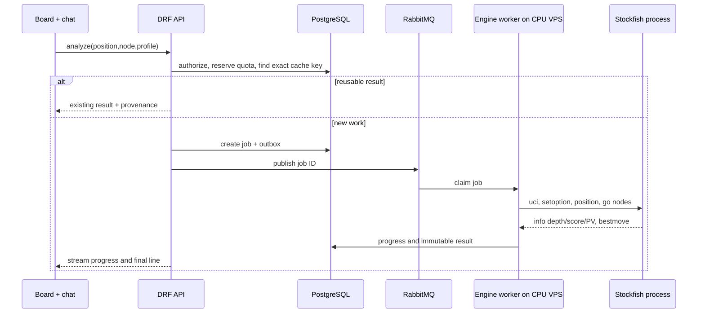

# Stockfish on VPS: execution and capacity

Status: proposed design with benchmark gates
Updated: 2026-09-26

## Direct answer

Stockfish is a native executable speaking the UCI protocol. A server worker starts an approved binary as a child process, sends a legal position and a bounded `go` command through stdin, reads `info` and `bestmove` from stdout, and terminates or reuses the process under supervision. A user request does not SSH into a VPS or run Stockfish inside Django. The API creates an analysis job; a dedicated CPU worker executes it and streams progress back to the browser. [Stockfish UCI commands](https://github.com/official-stockfish/Stockfish/wiki/UCI-Protocol-and-Stockfish-Commands), [python-chess engine API](https://python-chess.readthedocs.io/en/latest/engine.html).

## Request path



Stockfish computes evaluations and principal variations. It does not answer which move Carlsen historically played; the game corpus answers that. The LLM can compare both and explain the difference.

## Worker design

- Compile or obtain an approved Stockfish build for the VPS CPU instruction set. Pin engine binary and NNUE network hashes; register version and license.
- Start a bounded number of processes; set `Threads`, `Hash`, `MultiPV`, and optional Syzygy path per approved analysis profile.
- Use `go nodes N` for reproducible budget accounting; use wall-time limits as an additional hard ceiling. Record achieved depth, nodes, elapsed time, score perspective, WDL if available, and all PVs.
- Validate the FEN and every returned PV against legal moves. An engine score is not a proof of a strategic plan.
- Run processes with CPU/memory/pid limits, restricted filesystem, no general network, low-privilege user, and bounded stdout. Kill a process group on timeout or cancel.
- Reuse warm workers to avoid startup costs, but clear hash or isolate jobs according to reproducibility and privacy policy.
- Keep engine workers on dedicated compute nodes, separate from API, PostgreSQL, and ingestion.
- Prioritize interactive jobs over batch report jobs. A user navigating rapidly cancels or deprioritizes obsolete node analyses.

The official Stockfish project lists UCI options such as `Threads`, `Hash`, `MultiPV`, `UCI_ShowWDL`, and `SyzygyPath`, and supports `go nodes`, `go infinite`, and `stop`. [Source](https://github.com/official-stockfish/Stockfish/wiki/UCI-Protocol-and-Stockfish-Commands).

## Capacity model

The capacity bottleneck is simultaneous *active searches*, not registered accounts.

Illustrative 16-vCPU / 32-GiB engine VPS:

| Profile | Engine threads | Hash | Illustrative slots | Notes |
|---|---:|---:|---:|---|
| quick | 1 | 128–256 MiB | up to ~12 | leave CPU/RAM for OS, supervisor, bursts |
| standard | 2 | 256–512 MiB | up to ~6 | fewer concurrent users, faster individual search |
| deep | 4 | 1–2 GiB | up to ~3 | queued and quota-controlled |

These are *admission-control starting points*, not a performance guarantee. Actual NPS, P95 wait, memory, and thermal/CPU steal behavior must be measured on the chosen VPS. Do not advertise “500 simultaneous deep analyses” on one host. A 500-user app can still fit a small engine fleet if only a fraction analyze at once and cached results cover common positions; if 100 active analyses occur, scale workers horizontally or queue according to paid capacity.

Compute budgeting uses:

```text
required engine slots ≈ peak concurrent active analyses × (1 - cache-hit fraction)
CPU-seconds per request ≈ wall time × allocated vCPU threads
monthly core-hours ≈ sum(CPU-seconds) / 3600
```

`MultiPV=3` tends to consume more work than `MultiPV=1` at the same depth. Depth alone is a poor price/capacity unit; nodes plus hard wall time are easier to budget. Measure real representative positions, including openings, tactics, endgames, and complex middlegames.

## Cache identity and privacy

Cache by canonical position, variant, full engine build/network, options, threads/hash where relevant, tablebases, budget type/value, MultiPV, score schema, and sharing scope. A result from 100k nodes does not satisfy a 10M-node request. A result for a public position may be reused across tenants; private study position metadata and user intentions do not enter a public cache or log.

Precompute a limited set of frequently viewed opening positions and report candidates. Do not run Stockfish on every move in the billion-game archive. Existing [Lichess evaluation dumps](https://database.lichess.org/#evals) can be investigated as a separate source of position evaluations, with their own version/provenance/coverage limits; they do not replace fresh reproducible analysis for every question.

## Strategic goal questions

For “trade knights and reach an opposite-colored-bishop ending,” the worker can search candidate moves, while a deterministic board-state checker tests whether a branch reaches the requested material pattern. The planner then checks opposing replies within the allocated search budget. Output must distinguish:

- **example line:** one legal continuation reaches the goal;
- **robust candidate:** several strong opponent replies were examined and the plan remains plausible;
- **forced line:** a bounded tactical claim supported by exhaustive or sufficiently defensible search for the stated horizon;
- **unavailable:** no supported line found within the budget.

For file-control questions, a board feature extractor identifies open/semi-open files, rook/queen placement, attacks, defenders, and candidate moves. Stockfish evaluates concrete continuations; the chat explains the plan with arrows and node-specific caveats.

## Licensing

The [Stockfish repository](https://github.com/official-stockfish/Stockfish) states GPLv3 distribution conditions. Running an approved server-side binary and communicating over UCI is a straightforward technical route; distributing Stockfish binaries, a desktop companion, or WebAssembly builds requires GPL compliance review and accompanying source/license obligations. Keep the engine as a separate process and preserve its attribution. This is an engineering decision, not a legal opinion.

## Benchmark gate before deployment

Measure on the intended VPS: positions/second at each profile, warm/cold startup, RAM/process, P95 queue wait at 10/50/100 active jobs, cancellation latency, crash cleanup, cache hit rate, and monthly core-hour estimate. Upgrade the worker fleet only from these results.
