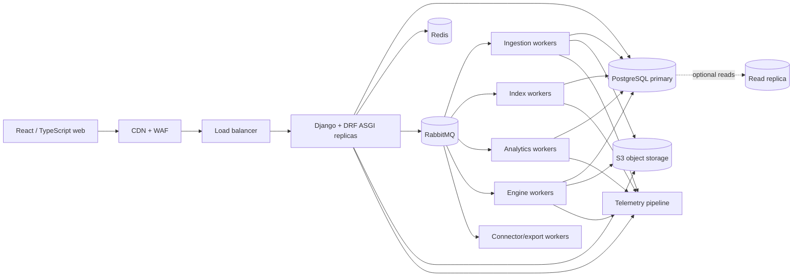

# Backend system design

Status: proposed implementation architecture
Last updated: 2026-09-23

## 1. Design objective

Serve 300–500 concurrent research users, multi-million-game corpora, background imports/analytics, and isolated engine analysis while preserving a credible path to ChessBase-class scale. The design optimizes for correctness and evolvability before distribution.

## 2. Runtime topology



### Deployable units

| Unit | Scale axis | Stateful? |
|---|---|---|
| `web` | request concurrency/latency | no |
| `worker-ingestion` | source bytes and games/minute | no |
| `worker-indexing` | positions/second and database I/O | no |
| `worker-analytics` | CPU/SQL time | no |
| `worker-engine` | physical CPU/RAM and process count | no local truth |
| `worker-connectors` | provider quotas and export load | no |
| PostgreSQL | storage, IOPS, connections | yes |
| RabbitMQ | durable task delivery | yes |
| Redis | cache/ephemeral coordination | disposable state |
| object storage | raw and large immutable artifacts | yes |

## 3. Request flows

### Interactive exact-position query

```text
client -> API auth/policy -> normalize FEN -> compute and verify position key
-> cache lookup -> PostgreSQL aggregate/occurrence query
-> shape response with snapshot/freshness -> cache -> client
```

No engine or LLM call is part of this critical path.

### Import

```text
client -> create import with idempotency key -> raw upload URL/object
-> PostgreSQL job + outbox -> RabbitMQ -> ingestion stages
-> canonical transaction batches -> index queue -> aggregate refresh
-> corpus snapshot candidate -> validation -> publish
```

The client follows the job by SSE or polling. Partial failure lists are downloadable artifacts.

### Engine analysis

```text
client -> validate position/profile/quota -> cache lookup
-> analysis job -> engine queue -> isolated UCI process
-> immutable result transaction -> progress/result event -> client
```

### Player card

```text
scheduled/provider sync -> rating observations + identity candidates
game corpus -> snapshot-bound player metrics
licensed media -> attribution record
projection builder -> cached player snapshot -> API
```

## 4. Transaction and event strategy

The first release uses a transactional outbox:

1. application state and outbox event commit in one PostgreSQL transaction;
2. dispatcher publishes the event/task to RabbitMQ;
3. consumer records a stable deduplication key before applying side effects;
4. derived data records their input version and may be rebuilt.

This prevents the classic “database committed but task not queued” gap. It does not imply an unrestricted event-sourced architecture.

## 5. Scaling strategy

### API tier

- stateless replicas behind a load balancer;
- bounded Gunicorn/Uvicorn worker count based on memory and database connections;
- PgBouncer transaction pooling;
- query timeouts and maximum page sizes;
- CDN for static assets and safe public immutable responses;
- admission control for expensive endpoints.

### Database tier

- separate transactional tables from high-volume position partitions;
- narrow hot indexes; query plans verified at target cardinality;
- scheduled vacuum/analyze and partition maintenance;
- read replica only for safe, freshness-tolerant reads after measurement;
- bulk ingestion through staging tables and set-based merges;
- materialized aggregate tables for explorer/player cards rather than repeated scans.

### Worker tier

- independent autoscaling by queue age and resource saturation;
- engines never co-located with latency-sensitive API processes;
- connector lanes enforce upstream concurrency and retry policy;
- per-workspace fair scheduling and quotas prevent one large import from starving all users;
- bounded work chunks allow cancellation and retries.

### Storage specialization trigger

PostgreSQL position storage is replaced or complemented only when target-scale benchmarks show an accepted SLO/cost/rebuild failure. Candidate extraction boundaries are:

- immutable occurrence scans and aggregates -> ClickHouse;
- exact position-key lookup -> specialized KV/RocksDB service;
- offline metric research -> Parquet + DuckDB.

Application APIs and stable position/game IDs must not change when a backend changes.

## 6. Failure design

| Failure | Expected behavior |
|---|---|
| Redis unavailable | slower responses; authoritative operations continue or fail closed where rate state is security-critical |
| RabbitMQ unavailable | new async commands remain recorded/unpublished; outbox retries after recovery |
| Worker crash | lease expires; idempotent unit is retried; job remains inspectable |
| PostgreSQL primary unavailable | readiness fails; mutations stop; no queue consumer acknowledges uncommitted work |
| Object storage unavailable | raw/exports pause; metadata does not claim completion |
| Connector returns 429 | provider lane pauses with documented backoff; other providers continue |
| Provider schema changes | payload quarantined; connector health alert; old good data remains |
| Engine hangs/crashes | hard limit terminates process; attempt recorded; host health evaluated |
| AI provider unavailable | deterministic database, statistics, and engine workflows remain usable |

## 7. Multi-tenancy and trust boundaries

- One shared application/database deployment initially, with workspace-scoped records.
- Service-layer authorization is mandatory; RLS protects the most sensitive workspace tables.
- Public/open corpus data and private user data have separate visibility classes and aggregation policies.
- Object keys are unguessable and delivered through short-lived signed URLs after policy checks.
- Provider credentials are encrypted per connection and only connector workers can decrypt them.
- Engine inputs are treated as untrusted; workers have no general outbound network access.
- Administrative interfaces run under separate permissions and audit requirements.

## 8. Deployment environments

| Environment | Purpose | Data rule |
|---|---|---|
| local | developer workflow and deterministic fixtures | synthetic/open tiny corpus |
| CI | tests and migrations | ephemeral synthetic data |
| staging | production-like integration/load rehearsal | sanitized/open data only |
| production | real users and approved corpora | policy-enforced data classes |

Infrastructure is declarative. Images are immutable and pinned by digest. Database migrations are a separate controlled release step. Production deploys use rolling or blue/green application changes compatible with both old and new schemas.

## 9. Backup and recovery baseline

Proposed beta targets, subject to business approval:

- PostgreSQL point-in-time recovery, RPO <= 15 minutes, RTO <= 4 hours;
- daily logical/physical backup verification and quarterly restore exercise;
- object versioning and lifecycle policy for raw artifacts;
- broker definitions backed up, but task recovery is also driven from PostgreSQL job/outbox state;
- Redis is rebuilt, not restored as a source of truth;
- recovery procedures include integrity reconciliation of jobs, derived indexes, and evidence.

## 10. Architecture review gates

Review is required before:

- adding a synchronous endpoint that can scan an unbounded corpus;
- adding a new datastore or message broker;
- creating a cross-module database write;
- allowing private data into shared aggregates;
- adding an external connector without rate/license/retention policy;
- changing position identity or metric semantics;
- running an engine or AI call in an API request path;
- extracting a microservice.

## 11. Source-informed implementation notes

- DRF permissions remain explicit per view/viewset; authentication and permission behavior is covered by contract tests.
- DRF cache-backed throttles are fair-use controls, not a security perimeter.
- PostgreSQL declarative partitioning and parent-defined indexes are used for high-volume tables; BRIN is reserved for physically correlated data.
- Celery long-running queues use idempotent tasks, late acknowledgement where safe, low prefetch, explicit routing, and hard/soft time limits.

Current framework/version details must be rechecked against official documentation immediately before implementation.
